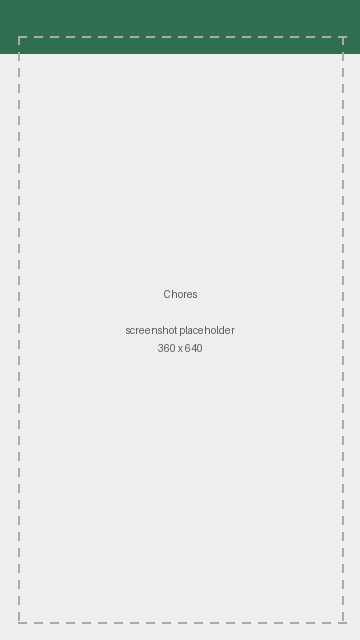
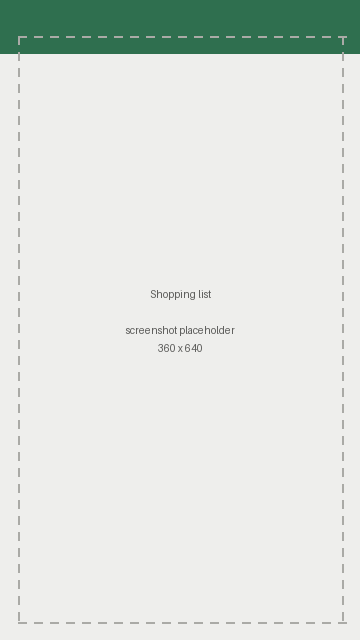
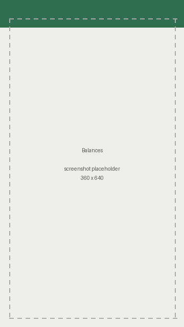
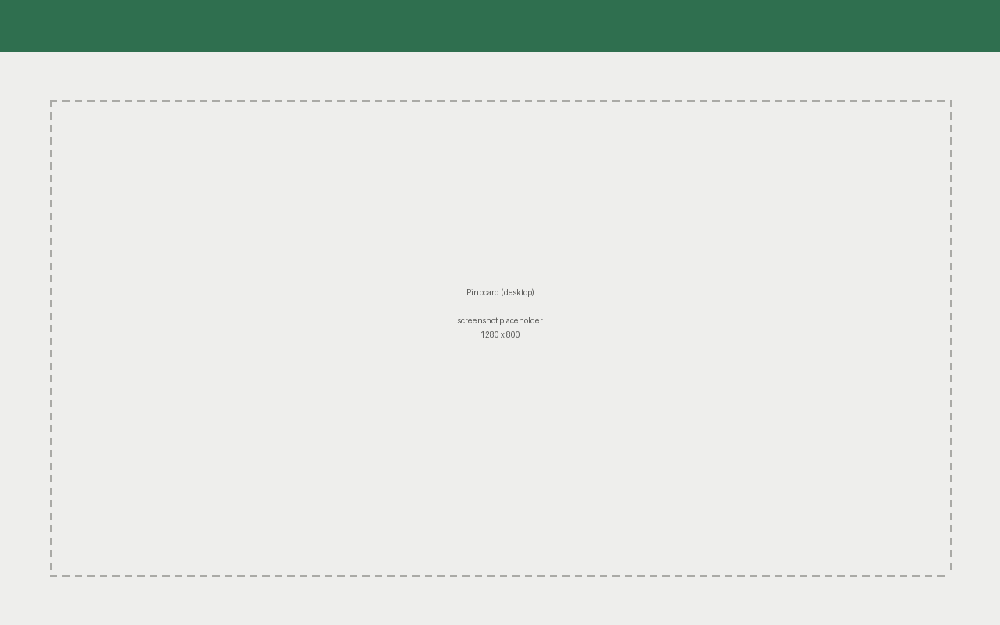

# Kehrwoche

**Who cleans the bathroom this week? Who owes whom? What's on the shopping list?**
Kehrwoche is a free, self-hosted web app that keeps a shared household running — chores with
fair rotation, a shared shopping list, split expenses with a minimal settlement, and a feed
that ties it all together.

No accounts in someone else's cloud, no tracking, no premium tier. One container, your data.

*Auf Deutsch: [README.de.md](README.de.md)*

## What's a *Kehrwoche*?

The *Kehrwoche* ("sweeping week") is a centuries-old Swabian tradition from south-west
Germany: cleaning the shared parts of a building is a duty that moves from household to
household, week by week. Everybody takes a turn, nobody carries it alone. That rotation is
exactly what this software does for the people you live with — hence the name.

## Screenshots

The phone is the lead device; the desktop layout is a full but secondary adaptation.

| Chores | Shopping list | Expenses |
|---|---|---|
|  |  |  |



## What it does

**Chores.** Recurring tasks that rotate through the household, or fixed ones that always
belong to the same person. Due dates, points, a leaderboard, and a reminder you can send
to whoever is on duty. Ticking a chore off takes one tap and can be taken back for five
minutes — no confirmation dialog for something you do every day.

**Shopping list.** Add, tick off, and clear everything bought in one go. Suggestions come
from a list in your language and from what this household bought recently, so most items
take a tap instead of typing.

**Shared expenses.** Enter what you paid and who shares it; the split is even by default,
down to the last cent. Running balances per person, and a settlement that gets everybody
back to zero in as few payments as possible. Settled periods are archived, not deleted.

**Pinboard.** Everything that happens in the other three modules appears here, mixed with
posts people write themselves — with likes and comments. It doubles as the audit log:
system entries cannot be edited or deleted by anyone.

**And around it:** in-app notifications, two languages (German and English, extendable at
runtime), avatars, roles, join codes and an admin CLI.

**Updating is a pull and a restart.** The container checks itself before it serves
anything: configuration, database, whether it can write where it has to, and whether the
schema matches the image. On SQLite it copies the database before migrating it and puts
the copy back if the migration fails. Anything it cannot put right stops it, with the
reason in plain sentences — the server starts last, so a failed update cannot have
changed a chore, an expense or a password.

## Quick start

You need Docker with the Compose plugin. Three commands:

```bash
curl -O https://raw.githubusercontent.com/ChrissWalters/Kehrwoche/main/docker-compose.yml
docker compose up -d
docker compose logs -f kehrwoche
```

Open `https://<the machine's address>:8443`. The container generates its own certificate
on first start, so the browser will warn you once — that is expected, see
[the FAQ](docs/faq.md#why-does-my-browser-warn-me-about-the-certificate).

Register, found a household, pass the join code to the people you live with. Whoever
founds it is the admin.

More ways to run it — MariaDB, PostgreSQL, a reverse proxy, your own certificate — are in
[docs/installation.md](docs/installation.md).

## Documentation

| | |
|---|---|
| [Installation](docs/installation.md) | Compose files, databases, updating, uninstalling |
| [Configuration](docs/configuration.md) | Every environment variable, TLS modes, ports |
| [Reverse proxy](docs/reverse-proxy.md) | A tested Caddy example, and what a proxy has to pass through |
| [Backup and restore](docs/backup-restore.md) | What to save, how to put it back |
| [FAQ](docs/faq.md) | Certificates, HTTPS-only browser features, passwords, languages |
| [Security policy](SECURITY.md) | How the app protects itself, and how to report a problem |

## Running it safely

Kehrwoche is built for a home network or a VPN. It is written to survive on the public
internet — authentication, TLS, CSRF protection, rate limiting, a strict content security
policy — but it is **not audited software**, and exposing it is entirely at your own risk.

If you do expose it, this is the minimum:

1. Terminate TLS in front of it with a real certificate and run the container with
   `TLS_MODE=off` behind that proxy. Never plain HTTP to the outside.
2. Close registration with `REGISTRATION_OPEN=false` once everybody has an account.
3. Keep the image current — an update is a pull and a restart.
4. Back the data up, and check that a backup can actually be restored.
5. Let the proxy pass the real client address, or the rate limits will count the whole
   internet as one visitor.

The long version, including what is in scope for a security report, is in
[SECURITY.md](SECURITY.md).

## The API

Kehrwoche is an API with a browser client in front of it, and the API describes itself:
`GET /api/v1/openapi.json` returns the full OpenAPI document — every endpoint, every
field, every error — generated from the code, so it can never drift from what the server
actually does. It is available to signed-in admins of a household.

There is no interactive documentation page built into the instance: it would have to
fetch its own assets from a content delivery network, which this project does not do.
Load the document into a tool on your own machine instead — for example

```bash
curl -b cookies.txt https://kehrwoche.local/api/v1/openapi.json > kehrwoche-api.json
```

and open that file in Bruno, Insomnia, Postman, Swagger Editor or any client generator.

## Issues yes, pull requests no

**Bug reports, questions and ideas are very welcome — please open an issue.** That is the
one channel, and it is used: what people run into is what gets fixed.

**Pull requests are not accepted**, and it is friendlier to say so before you spend an
evening on one. This is a single-maintainer project; reviewing other people's code well
enough to be sure of what goes into an image other households run is a skill and a time
commitment I do not have to give right now. Turning that down after the work is done would
be worse than saying it here.

Nothing about that limits what you may do with the software. It is AGPL-3.0: fork it,
change it, run your changed version, pass it on. The licence asks only that your version
stays under the same terms and keeps the notices intact.

If you have fixed something in your fork, an issue describing it — or linking to your
commit — is genuinely useful. It just travels back through me rather than through a merge
button.

### Working on your own copy

```bash
pip install -e ".[dev]"
pytest
ruff check . && ruff format --check .
```

The test suite runs against SQLite in memory; continuous integration additionally runs it
against MariaDB and PostgreSQL, because the schema has to stay dialect-independent.

A few conventions, in case they save you time:

* **Code, identifiers, comments and commit messages are English.** User-facing text is
  German and English, and never hard-coded — it lives in `app/locales/`.
* **No build step, no npm.** The browser client is plain ES modules with Vue 3 shipped as
  a file. Components are render functions, not templates: the template compiler would
  need `unsafe-eval`, and the content security policy does not allow it.
* **Money is integer cents, times are timezone-aware UTC, ids are integers.**
* **Routes do not touch the database.** Business logic lives in `app/services/`, and every
  business route goes through `require_member()` or `require_admin()`.

### Translating

Every text lives in a flat JSON file under `app/locales/`, keyed like `chores.form.title`.
Adding a language is copying `en.json` and translating the values:

1. Copy `app/locales/en.json` to `app/locales/<code>.json` (a two-letter code, e.g. `fr`).
2. Translate the values. Leave the keys alone, and keep every `{placeholder}` exactly as
   it is — a `{name}` that becomes `{naem}` shows up as literal braces on somebody's phone.
3. Set `"language.name"` to the language's own name, the way its speakers write it.
4. Two entries are lists rather than sentences: `chore_templates` and
   `shopping_suggestions`. They are content too — translate them, and feel free to swap
   items that make no sense where the language is spoken.

You do not have to rebuild anything to try it: mount a folder as `/app/locales-extra` and
the server merges it over the bundled files at start-up, offering the new language right
away. Anything you leave out falls back to English. See
[docs/configuration.md](docs/configuration.md#extra-language-files).

**To get a language shipped with the next release, open an issue and attach the finished
`<code>.json`** — a link to a file in your own repository works too. Translations are the
one contribution that needs no code review, so they are easy to take. Please say how you
would like to be credited, or that you would rather not be.

The test suite checks that every bundled language carries the same keys and the same
placeholders, so a file with a typo in a key does not get far.

## Supporting the project

Kehrwoche is free and stays free: no paid tier, no licence key, no feature held back. If
it saves your household an argument now and then and you would like to say thank you:

* [Ko-fi](https://ko-fi.com/chrisswalters)

Entirely voluntary, and nothing about the software depends on it — there is no supporter
edition and there will not be one.

## Versioning

[Semantic versioning](https://semver.org). The running version is in `GET /api/v1/meta`;
what changed between releases is in [CHANGELOG.md](CHANGELOG.md).

Container images are tagged `1`, `1.0`, `1.0.0` and `latest` — pin the major tag in your
compose file to get fixes without surprises.

## Third-party components

Kehrwoche ships a few files it did not write itself. Each is listed here with its origin
and licence; the licence text and provenance are also repeated in the file itself.

| Component | Used for | Licence |
|---|---|---|
| [Vue 3](https://vuejs.org) 3.5.40 — `app/static/vendor/vue.esm-browser.prod.js` | The browser app; shipped as a file so nothing is loaded from a CDN | MIT |
| [SecLists](https://github.com/danielmiessler/SecLists) — `Pwdb_top-1000.txt`, stored as `app/data/common_passwords.txt` | Rejecting the 1000 most common passwords at registration | MIT |

Vendored files are byte-identical to their published release. Origin, checksum and how
each one was verified are documented in `app/static/vendor/README.md`; the test suite
re-checks the checksums on every run.

Everything else Kehrwoche depends on is installed from PyPI and declared in
`pyproject.toml` (FastAPI, SQLAlchemy, Alembic, Pydantic, argon2-cffi, Pillow, uvicorn,
Typer and the database drivers), each under its own permissive licence. Nothing is
fetched from a CDN or any other network service at runtime.

## Development

AI coding tools were and are used to support the development of Kehrwoche.

## Licence

[GNU Affero General Public License v3.0 or later](LICENSE). Provided **without any
warranty**. Running an instance outside a closed home network — in particular on the public
internet — is entirely at the operator's own risk.
